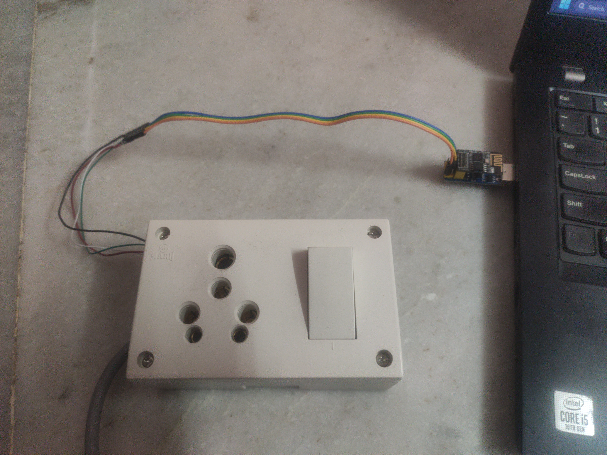

# PZEM-004T_MQTT_ESP32-ESP01-ESP8266

# **MQTT Data Sender for PZEM-004t Meter Readings**
This is a simple code for sending the PZEM-004t meter readings to an MQTT broker over WiFi using an ESP32 or ESP8266 microcontroller. The code uses the PubSubClient library for MQTT communication, the PZEM004Tv30 library for reading data from the PZEM-004t meter, and the ArduinoJson library for handling JSON data. The code can be uploaded to an ESP32 or ESP8266 board using the Arduino IDE.

## __Libraries Used__
- __PubSubClient.h__: MQTT library for ESP32 and ESP8266. Used to establish connection with the MQTT broker and publish data to specific topic.
- __PZEM004Tv30.h__: Library used for reading voltage, current, power, energy, frequency, power factor and alarms from PZEM-004t meter.
- __ArduinoJson.h__: JSON library used for parsing and serializing data in JSON format.
- __WiFi.h__: This library is used to connect to Wi-Fi network. It is included for ESP32.
- __ESP8266WiFi.h__: This library is used to connect to Wi-Fi network. It is included for ESP8266.
- __SoftwareSerial.h__: This library provides a class for software serial communication. It is included for ESP8266.
## __Hardware Requirements__
- ESP32 or ESP8266 microcontroller
- PZEM-004t power meter
- USB cable
- Breadboard
- Jumper wires
## __Code Description__
The code starts by defining the libraries required for MQTT, PZEM-004t and JSON. Then it defines the serial port, WiFi credentials, MQTT broker IP, port, username, password, topic, and client ID. The code then sets up the WiFi and MQTT connection by calling the `Connect_WiFi_and_MQTT()` function. The function sets up the WiFi connection by connecting to the WiFi network defined by the SSID and password, and then sets up the MQTT connection by connecting to the MQTT broker defined by the broker IP and port.

The `loop()` function is used to read data from the PZEM-004t meter using the `ReadData()` function, convert the data to a JSON object, and publish it to the MQTT broker. The `ConnectionCheck()` function is used to check the MQTT connection status and reconnect if necessary.

The `ReadData()` function reads voltage, current, power, energy, frequency, power factor and alarms from the PZEM-004t meter and stores them in a DynamicJsonDocument object. The function then creates a nested JSON object to store the meter readings under the "data" key and returns the complete JSON document.

The `reconnect()` function is used to reconnect to the MQTT broker if the connection is lost.

## __Instructions for Use__
1. Connect the PZEM-004t meter to the ESP32 or ESP8266 using  jumper wires as per the library instructions.
2. Open the Arduino IDE and install the required libraries.
3. Copy the code and paste it into a new sketch.
4. Modify the code to match your WiFi and MQTT settings.
5. Connect the ESP32 or ESP8266 to your computer using a USB cable. If you're using an ESP8266 module other than the ESP-01, make sure to change the RX_PIN and TX_PIN values in the code snippet below to match the pins you're using:
    ```C
    // ESP8266 libraries
    #include <SoftwareSerial.h>             // Importing the Softwarial serial library
    SoftwareSerial pzemSerial(RX_PIN, TX_PIN);        // Use software serial on ESP8266
    PZEM004Tv30 pzem(pzemSerial);           // Assigning the software serial to PZEM library
    #include <ESP8266WiFi.h>    
    ``` 
6. Upload the code to the microcontroller.
7. Open the Serial Monitor to view the program output and verify that the connection to the MQTT broker is successful.
8. Verify that the data is being published to the MQTT broker by subscribing to the topic defined in the code.

<p align="center">
  
</p>
<p align="center">
  
</p>